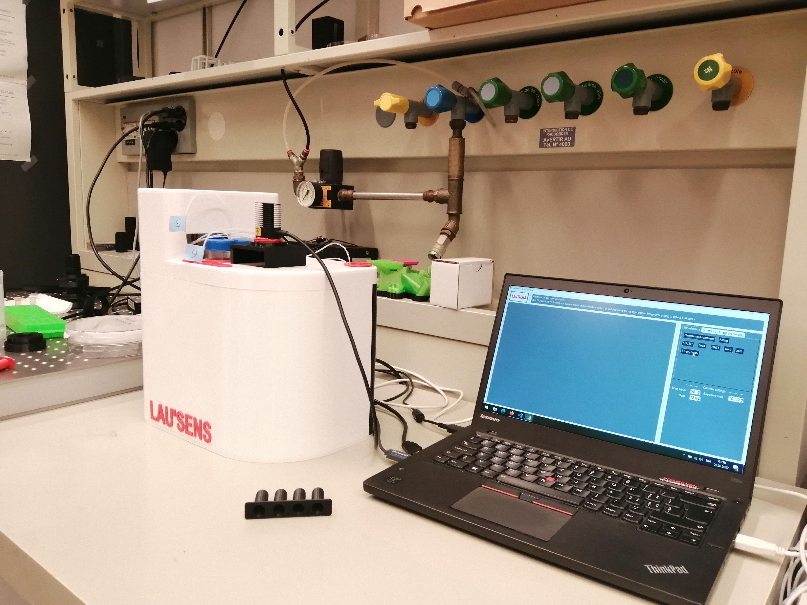

# Sens'Us - LauSens team 2022

## Info

Welcome to LauSens 2022 repo. ! You will find in this repo all code used for SensUs Eindhoven competition.

### Tree

Folders

- `image_analysis` : contains code for image analysis & processing
- `main` : contains code for controlling microfluidics pump, auto-focusing microscope and image processing
- `utilities` : contains utility and testing code

### How to start ?

Clone repo :

`git clone git@github.com:nereaiscamu/LauSens_2022.git`

Go to main script :

`cd LauSens_2022/main`

Install packages with `pip` :

`pip install PySimpleGUI`

`pip install Pillow`

`pip install opencv-python`

`pip install pyserial`

`pip install scikit-image`

`pip install matplotlib`

`pip install scikit-learn`

Install package PySpin via `https://flir.app.boxcn.net/v/SpinnakerSDK/` (choose your OS, python folder, and processor architecture) following README.txt in downloaded folder.

Then run script with python3:

`python3 gui.py`

### Awards :

Winner of Analytical Performance

Winner of Translational Potential

Runner-Up for Public Inspiration

### Many thanks

Thanks to our software engineers and micro-flu engineers: Gaiëtan Renault, Nerea Carbonell Muñoz and Camille Pescatore and Titouan Marois and Kuzey Mehmet

Thanks to EPFL BIOnanophotonic Systems laboratory (BIOS), ForumEPFL, Thorlabs, AMF Advanced microfluidics and COMSOL.

## The LauSens EPFL team 2022.

For any question about the code please contact me at : `gaietan.renault@alumni.epfl.ch`

