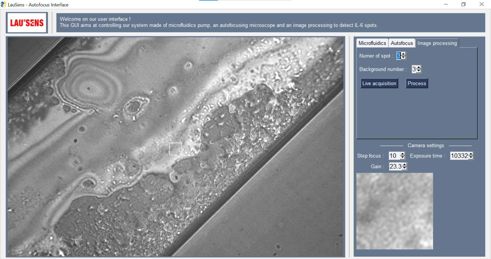
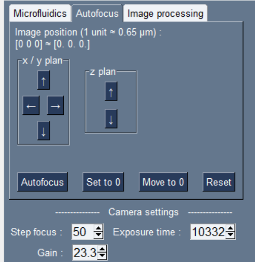
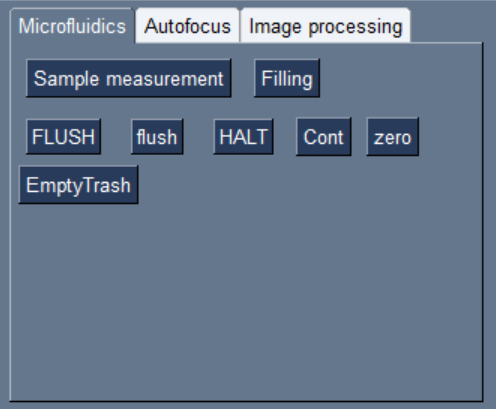
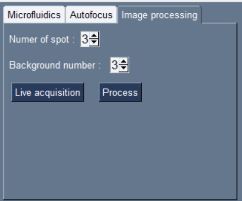

# User manual

## User interface

## Overall presentation

- You'll find on top a simple explanation.

- On left side you'll find a live stream received from camera (BFS-U3-200S6M-C USB 3.1 Blackfly S, Monochrome Camera) via serial. White square in middle of image is a fixed numerical zoom displayed at bottom right. By left-clic and drag on image, you will draw a white rectange, and it will zoom into this rectange. By right-click and secting `Copy` you can automatically save currently displayed image to `main/img_proc/saved_img` folder.

- On right side you'll find everything to control microfluidic pump, camera and image processing in Microfluidics, Autofocus and Image processing tab respectively.

## Autofocus tab

- First [x, y, z] coordinates are camera position. When launching soft. camera position is at [0, 0, 0] and when closing soft., camera will automatically move back to [0, 0, ...] position (i.e return to original position only in x/y plan and NOT along focusing axis)

- You will then find command arrows to move camera along x/y plan and along z (focusing) axis.

- Clicking on `autofocus` will move camera to obtain best focus (3 different algo exist for that). Clicking on `set to 0` set the current position to be initial position (i.e [0, 0, 0]). Clicking on `move to 0` move camera back to initial position (i.e [0, 0, 0]).

- Camera setting are : `step focus` setting camera movement step (= how much camera will move when clicking on arrow), `exposure time` set exposure time (internal camera parameter), `gain` set image gain.

## Microfluidics tab

See EPFL LauSens drive for more information about how to control AMF micro-fluidic pump or contact `titouan.marois@alumni.epfl.ch`.

## Image processing tab

- Live acquisition will start to save every 10 sec 5 consecutive images in `main/img_proc/images`, compute one median image of those five imgs and save it in `main/img_proc/images_processed`.

- Process (NEED to STOP LIVE acquisition before doing it) will display saved image in `main/img_proc/saved_img` and will ask you to first place two cerlces in background of image then place two Regions Of Interest (ROI) in spot of image (Use `z, q, s, d` to move cercle and `a` to select. You can also change cercle diameter.).
  Then after image processing, it will display you one black and white image, one plot results, and finally will print (IN TERMINAL in which you ran `gui.py`) the results.
